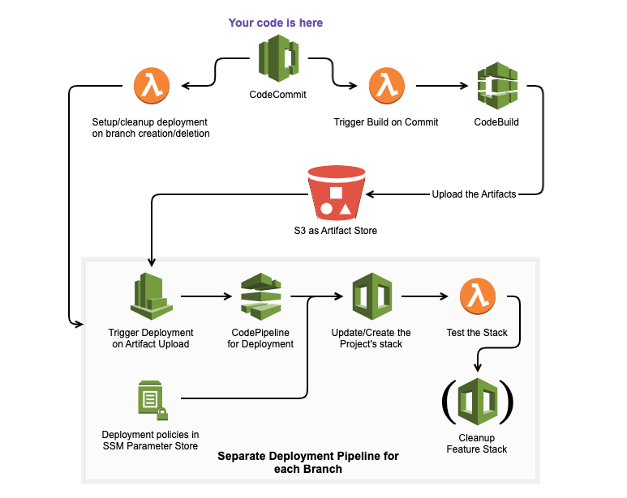

# CloudFlow

This repository contains a framework for gitflow-like CI/CD of AWS Infrastructure and all its dependencies. After initializing
CloudFlow in your AWS account you will be able to create projects. A CloudFlow CI/CD project is represented by the following diagram:




It contains a CodeCommit repository that is connected to
pipelines for building, deploying, testing, and maintaining CloudFormation stacks together with their dependencies on commits.

## Table of Contents

- [CloudFlow](#cloudflow)
  - [Table of Contents](#table-of-contents)
  - [Why should I use it?](#why-should-i-use-it)
  - [Initializing CloudFlow](#initializing-cloudflow)
  - [Creating and Updating Projects](#creating-and-updating-projects)
    - [In Detail](#in-detail)
      - [Use CloudFlow pipelines for your projects](#use-cloudflow-pipelines-for-your-projects)
      - [Develop your own pipelines](#develop-your-own-pipelines)
  - [Using Projects](#using-projects)
  - [CloudFlow Roles](#cloudflow-roles)
    - [The CloudFlow Admin](#the-cloudflow-admin)
    - [The CloudFlow DevOp](#the-cloudflow-devop)
  - [Contributing](#contributing)

## Why should I use it?

Using CloudFlow is extremely simple and can enormously boost a cloud-developer's productivity! Some of the advantages of CloudFlow over other approaches are the following:

1) No overhead and no external tools are needed to set it up. Only AWS services are used.
2) Nested stacks are supported.
3) All artifacts needed in a stack can be kept in a single repository.
4) It is easy to share artifacts across projects.
5) Build, deployment and testing happen on commit.
6) You have the option to create and customize your own project generator

Once a project is generated, the recipient of the project can focus on developing CloudFormation templates, code, scripts for lambda functions and in fact any kind of artifact needed for the stack. The CloudFlow pipelines will take care of packaging the dependencies, deploying and testing the resulting stack and cleaning up, all triggered by commits.

On top of that the AWS services that CloudFlow uses are essentially free (or at least really cheap).

## Initializing CloudFlow

Clone this repository, cd into it and call

```bash
./cloudflow/bin/cfl.sh init
```

After receiving the prompted input, CloudFlow will create its initial resources (which are s3 Buckets, a CloudTrail and a ssm parameter).

## Creating and Updating Projects


__tl; dr__

Call

```bash
./cloudflow/bin/cfl.sh deploy-project --project-name <name>
```

Lay back and enjoy developing infrastructure as code in a modular way while benefitting from automatic tests and all the other CI/CD niceties.

### In Detail

There are two essentially different ways to manage CloudFlow CI/CD projects.

#### Use CloudFlow pipelines for your projects

In this case you should create/update projects directly from the present repository by using the "cloudflow cli" - i.e. the script ```./cloudflow/bin/cfl.sh```. You only need to manage the configuration and possibly the project policies in ```./cloudflow/project_policies.yaml``` (see [Roles](#cloudflow-roles) for more detail on that). This is the easiest way to incorporate updates of CloudFlow into your projects.

#### Develop your own pipelines

In case you do want to adjust the CloudFlow default pipelines to your needs, the recommended way is to create one or multiple CloudFlow project generators by calling

```bash
./cloudflow/bin/cfl.sh deploy-generator --generator-name <name>
```

This command will create a CloudFlow generator (which is a special case of a CloudFlow project) based on the present repository in your AWS account. You can adjust the resulting generators according to your needs and benefit from their self-modification on commits (see [CloudFlow generators](GENERATOR_README.md) for more details).

## Using Projects

A CloudFlow project is used by creating feature branches, pushing changes and merging branches to develop and master. Usually, no interaction with the AWS console apart from monitoring the deployments will be needed. A detailed account on how to work with CloudFlow projects can be found [here](project-templates/default/README.md).

## CloudFlow Roles

One of the goals of CloudFlow is the separation of concern and responsibility. For that CloudFlow offers two distinct roles. One is the generator maintainer, let's call it the Admin, and the other is the project recipient, let's call it the DevOp.

### The CloudFlow Admin

The Admin manages one or multiple CloudFlow generators. They can do the following:

  1) Create and update projects and their deployment pipelines
  2) Control the ressources that can be deployed from the created project by managing permissions
  3) Choose where the project artifacts will be uploaded to
  4) Develop the CloudFlow generators which will update themselves on release

More detailed information can be found in the [CloufFlow Generator Readme](GENERATOR_README.md).

### The CloudFlow DevOp

The DevOp is the recipient of a CloudFlow project. They have control over the project's artifacts and the build process.  On commit to different branches all artifacts will be built, versioned and uploaded to S3.

Stacks for each branch will be deployed after a successful upload. On merging to the develop branch, the develop stack will be updated. This way the DevOp will know that an update can be safely performed on the live stack. Finally, on merging develop to master the live stack is updated. The DevOp has control over the stack's develop and live configuration.

It is easy to reference released artifacts across all projects. This modularity and code-sharing is one of the main ideas behind CloudFlow. 

More detailed information can be found in the [CloufFlow Project Readme](project-templates/default/README.md).

## Contributing

CloudFlow can benefit greatly from contributions from its users. Please contact me at mischa.panch@gmail.com if you want to contribute. Please open an issue if you encounter a bug or have a question. There are two simple ways to contribute:

- If you have used CloudFlow to setup a cool project, consider making a pull request and add it to the project-templates. Over time, together we can assemble a collection of templates for CI/CD projects for all kinds of resources.
- If you have adjusted CloudFlow Generators for your own case and incorporated a new feature, consider creating a pull request for it.

Of course, all other contributions and remarks are highly welcome as well.
